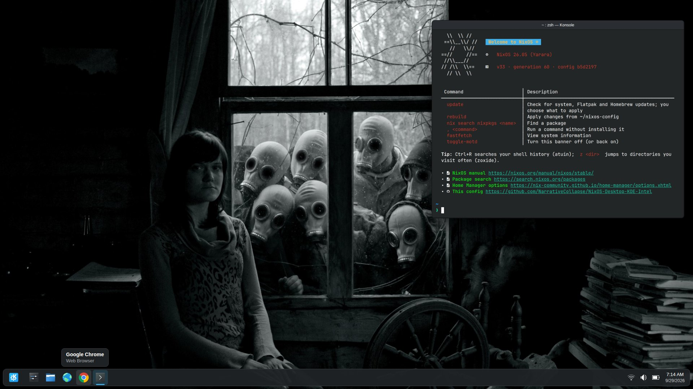
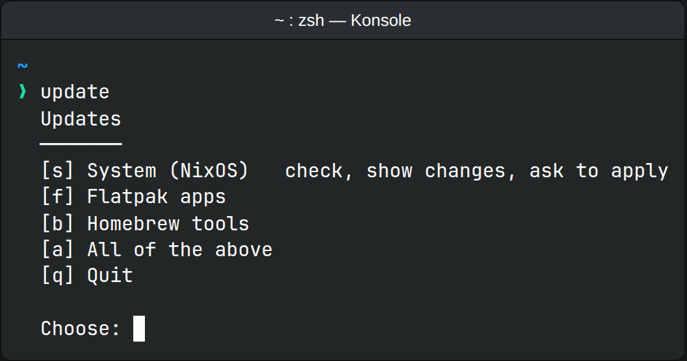
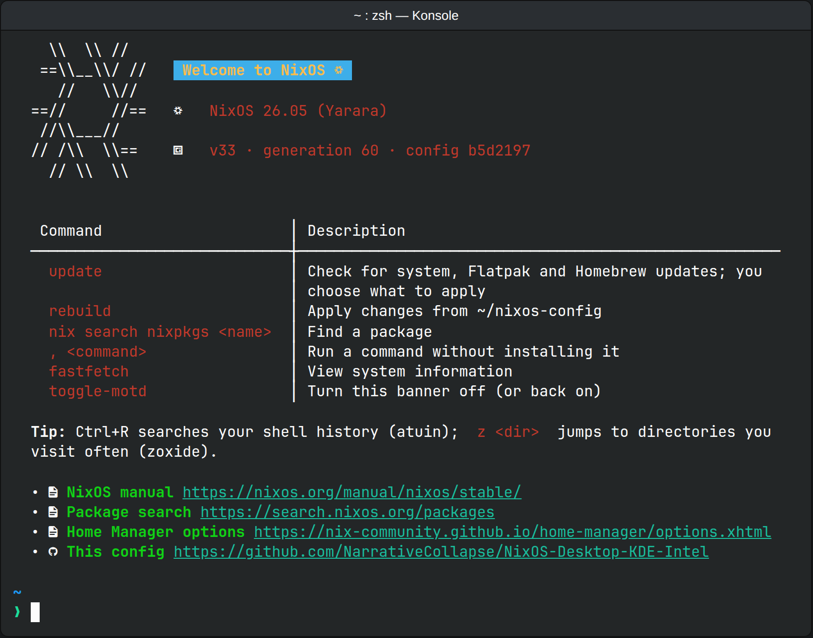

# NixOS-Desktop-KDE-Intel

Austin's flake-based NixOS 26.05 + Home Manager config for **shitbox**, an
HP Laptop 14-ep0xxx (Intel Gen12 graphics, LUKS-encrypted NVMe) running
Plasma 6.

**Current version: v40** (git tag `v40`). See [Versions](#versions).



<sub>An example of the desktop this config sets up: Breeze Dark, the default
wallpaper, the welcome banner in Konsole, and Google Chrome pinned to the
taskbar. It's a rendered mockup, not a photo of the laptop; the real
taskbar icons, tray and exact layout may differ.</sub>

## What's in it

- **Desktop:** Plasma 6 on SDDM, Wayland only (X11 apps run through
  Xwayland), in Breeze Dark; PipeWire; declarative Flatpak apps from Flathub
  (Chrome, VLC, Flatseal, qBittorrent, ISO Image Writer, Bazaar);
  Plasma/Konsole settings in the config (plasma-manager); extra wallpapers
  built into the system, with one set on the desktop, lock and login
  screens; Bluetooth via Plasma's BlueDevil; printing with automatic
  network-printer discovery (Avahi/mDNS); Noto + JetBrains Mono Nerd Font.
  Plasma defaults nothing here uses are left out (see `modules/desktop.nix`):
  the Orca screen reader and text-to-speech, the KDE PIM backend (Akonadi),
  the X11 session, Elisa, the Help Center, the remote desktop server, the
  QR scanner, the on-screen touch keyboard and Discover (Bazaar is the app
  store; see [Flatpak apps](#flatpak-apps)).
- **Hardware:** systemd-boot with the boot-menu editor locked, a graphical
  Breeze boot splash that also shows the disk password prompt (Plymouth),
  systemd initrd, LUKS with TRIM passed through to the SSD, zram swap with the
  kernel tuned for it (as on Fedora and Pop!_OS), systemd-oomd closing a
  runaway app before memory pressure freezes the desktop,
  power-profiles-daemon + thermald, fwupd, and Intel VA-API/QSV drivers so
  video decodes on the GPU. Closing the lid suspends on battery and does
  nothing on AC.
- **Network & security:** NetworkManager with systemd-resolved, Mullvad VPN
  (official module), firewall on with only Steam Remote Play's ports and
  mDNS (UDP 5353, for printer discovery) open, and hardening sysctls for
  untrusted Wi-Fi.
- **Gaming:** Steam with a gamescope session and Proton-GE available as a
  compatibility tool, GameMode, MangoHud, and xpadneo for Xbox controllers
  over Bluetooth.
- **Shell & tools:** zsh + Starship with a Bazzite-style terminal (welcome
  banner, branded fastfetch, eza/atuin/zoxide/direnv and friends; see
  [Terminal](#terminal-bazzite-style)), Neovim (treesitter, telescope,
  gitsigns), git, Podman (Docker-compatible) + distrobox, LibreWolf.
- **Maintenance:** flakes only (no Nix channels; `nix-shell -p` and
  `<nixpkgs>` use the same nixpkgs as the system), nh for rebuilds and
  weekly cleanup (keeps 14 days and at least 5 generations), weekly store
  deduplication, daily restic backups of
  `/home` (needs the one-time setup below) with a desktop warning when they
  go stale, and GitHub Actions that build every push (see [CI](#ci)).
- **Updates:** nothing updates on its own. `update` checks the system,
  Flatpak apps and Homebrew tools, shows what would change, and applies it
  only when you say yes (see [Updates](#updates)).

## Layout

```
flake.nix                        inputs, config version, HM wiring, checks, devShell
Brewfile                         CLI tools managed by Homebrew (see Homebrew below)
statix.toml                      statix lint config
wallpapers/                      extra wallpapers installed system-wide
CLAUDE.md                        rules for AI-assisted changes (checks, versioning)
docs/screenshots/                images used in this README
.github/actions/setup-nix/       CI setup shared by both workflows (disk space + Nix)
.github/workflows/
  check.yml                      CI: nix flake check + full system build
  update-flake-lock.yml          flake.lock update pull request (run by hand)
  bump-version.py                version bump used by the update workflow
hosts/shitbox/
  configuration.nix              host: hostname + stateVersion + imports
  hardware-configuration.nix     generated; LUKS + ext4 root + EFI boot
modules/
  base.nix                       nix settings, nh + GC, locale, unfree allowlist
  hardware.nix                   boot, Plymouth splash, TRIM, graphics, zram, sysctls, firewall
  desktop.nix                    Plasma 6/SDDM, PipeWire, Flatpak, Mullvad, fonts, lid
  gaming.nix                     Steam, Proton-GE, gamescope, GameMode, xpadneo
  shell.nix                      user, sudo, podman, system packages, zsh
  backup.nix                     restic job for /home (needs one-time setup)
  homebrew.nix                   Homebrew PATH, completions, `brew-update`
  notify-failure.nix             desktop notification when a background job fails
  updates.nix                    `update` menu: system, Flatpak and Homebrew updates
home/austin/home.nix             zsh, starship, git, neovim, mangohud
home/austin/bling.nix            Bazzite-style MOTD, fastfetch, CLI tools + aliases
home/austin/plasma.nix           Plasma/KDE settings via plasma-manager (Konsole profile)
```

## Install

```bash
# The rebuild aliases and nh (NH_FLAKE) expect the checkout at ~/nixos-config.
git clone https://github.com/NarrativeCollapse/NixOS-Desktop-KDE-Intel.git ~/nixos-config
cd ~/nixos-config

# Format, lint, and evaluate the whole system.
nix flake check

sudo nixos-rebuild switch --flake .#shitbox
```

## Everyday use

| Task | Command |
| --- | --- |
| Rebuild after editing | `rebuild` or `nh os switch` (works from any directory) |
| Update the system, Flatpaks or Homebrew tools | `update`, then pick (see [Updates](#updates)) |
| Roll back a bad rebuild | `sudo nixos-rebuild switch --rollback`, or pick an older entry in the boot menu |
| Format the tree | `nix fmt` |
| Lint + evaluate | `nix flake check` |
| Steam with MangoHud + GameMode | `steam-hud` (toggle the overlay with Right Shift + F12) |
| Run a game with Proton-GE | In Steam: right-click the game → Properties → Compatibility → tick "Force the use of…" → pick **GE-Proton** |
| See boot messages behind the splash | Press **Esc** during boot |
| Which commit is running? | `nixos-version --configuration-revision` |
| Which config version is running? | Shown in the welcome banner, `fastfetch`, and the boot menu entry (e.g. `v25-26.05…`) |

`nix flake check` fails on unformatted files, statix/deadnix findings, a
README whose "Current version" doesn't match `version` in `flake.nix`, or a
configuration that doesn't evaluate. `hosts/shitbox/hardware-configuration.nix`
is exempt from formatting and linting because regenerating it would undo any
changes.

In Neovim the leader key is Space: `<Space>ff` finds files, `<Space>fg`
searches text, `<Space>fb` lists open buffers.

## Updates

Nothing updates on its own. Run `update` (it's in the welcome banner)
whenever you want to check:



Or skip the menu: `update system`, `update flatpak`, `update brew`,
`update firmware`, `update all`, `update rollback`. Each part asks before it
changes anything.

- **[s] System** (`update-system`, in `modules/updates.nix`):
  1. Runs `git pull` in `~/nixos-config`, so changes pushed from elsewhere
     come first. It stops if `flake.lock`, `flake.nix` or `README.md` has
     uncommitted edits.
  2. Runs `nix flake update`. If nothing is newer, it says so and stops.
  3. Bumps the config version (`flake.nix`, the README's "Current version"
     and a Versions row naming the updated inputs) and commits it locally.
  4. Builds the new system without activating it, and lists every package
     whose version changes, plus the change in total size (`nvd`).
  5. Asks **Apply vN now?** On yes it switches to the new system (sudo
     password), tags the commit `vN`, and pushes the commit and tag to
     GitHub. On no, or if the build fails, the commit is undone and the
     repo is exactly as it was.

  If pushing fails (for example, no GitHub login on the laptop), the update
  is still applied, and it prints the two commands to push later.
- **[f] Flatpak** runs `flatpak update`, which lists pending updates and
  asks before installing them. System-wide apps may ask for your password.
- **[w] Firmware** (`update-firmware`) asks fwupd for BIOS and device
  firmware updates from the LVFS, and `fwupdmgr update` asks before
  installing and before any reboot. Many HP consumer laptops get none, in
  which case it says so.
- **[r] Roll back** (`update-rollback`) lists the last few system versions
  and, after a yes, switches back to the one before the current one (the
  same as choosing it in the boot menu, but it stays the default). Your
  `~/nixos-config` still holds the newer version, so the next `rebuild` or
  `update` returns to it; to stay back, undo the change there (for
  example `git revert HEAD`) and push.
- **[b] Homebrew** (`brew-update`, in `modules/homebrew.nix`) installs
  Homebrew the first time (after asking), runs `brew update`, then lists
  formulas that are missing, outdated, or installed but not in the
  Brewfile, and installs, upgrades and removes them to match only on a
  yes.

Still scheduled, because none of them change what's installed: nh's weekly
cleanup of old generations, weekly store deduplication, the daily backup,
fwupd's refresh of firmware metadata (firmware itself only installs through
`update` [w] or `fwupdmgr update`), and tldr's page cache. Nothing pops up
"updates available" notifications either: Discover, which would, isn't
installed.

## Terminal (Bazzite-style)

`home/austin/bling.nix` recreates [Bazzite](https://github.com/ublue-os/bazzite)'s
terminal the Nix way. Bazzite installs these tools with Homebrew
(`ujust bazzite-cli`) and appends lines to your shell's rc file; here Home
Manager declares all of it. Adapted from Bazzite (Apache-2.0).



<sub>Rendered from the banner script in Konsole's colors; the generation
number is an example.</sub>

- **Welcome banner:** every new terminal shows a small black-and-white
  NixOS logo beside the NixOS version, the system generation and config
  commit, then a table of common commands (starting with `update`), a
  random Nix tip, and links. It's skipped inside containers (distrobox,
  toolbox), since it describes this machine, not the box. `toggle-motd`
  turns it off or back on (same switch file as Bazzite's
  `~/.config/no-show-user-motd`).
- **fastfetch:** Bazzite's layout and icons with the NixOS logo; the first
  line shows the generation and config commit. `neofetch` runs it too.
- **Tools:** `ls`/`ll`/`la`/`lt` use eza (icons, folders first), `grep`
  uses ugrep, Ctrl+R searches history with atuin, `z <dir>` jumps to
  frequent directories (zoxide), `open <file>` opens it in the default app.
  The standalone tools (`tldr`, `tv`, bat, fd, ripgrep, gh, glab, jq, yq,
  dysk, trash-cli, shellcheck, stress-ng) come from
  [Homebrew](#homebrew).
- **direnv + nix-direnv:** add `use flake` to a project's `.envrc`, run
  `direnv allow`, and its `nix develop` shell loads whenever you `cd` in.
- **Command not found → which package:** type a command you don't have and
  the shell lists the nixpkgs packages that provide it. `, <cmd>` (comma)
  runs it straight away without installing, e.g. `, cowsay hi`. Both use
  [nix-index-database](https://github.com/nix-community/nix-index-database)'s
  prebuilt index, so nothing is indexed on the laptop. (Its message suggests
  `nix-env -iA` to install; in this config, add the package to the Nix
  config or Brewfile instead.)
- **Container badge:** when this prompt runs inside a container, Starship
  starts it with 📦 and the container's name, like Bazzite's prompt.
- **Your shell inside distrobox:** `~/.config/distrobox/distrobox.conf`
  shares `/nix/store`, your Home Manager profile and the current system
  (all read-only) with new boxes, so your zsh, prompt, badge and aliases
  load inside them. It applies to boxes created after this change; recreate
  older ones (`distrobox rm <name>`, then `distrobox create …`). This part
  couldn't be tested before release, so treat it as best-effort; if a box
  misbehaves, delete that file's line and recreate the box.

The icons come from JetBrains Mono Nerd Font. Konsole's default profile is
set by the config to "NixOS", which uses JetBrainsMono Nerd Font Mono so
icons fit the terminal grid (see [Plasma settings](#plasma-settings)). To
drop the whole setup, remove the `./bling.nix` import at the top of
`home/austin/home.nix`.

### Emoji and icons

Color emoji come from Noto Color Emoji. With this config they render in
GTK apps, KDE/Qt apps, Konsole, and LibreWolf, and the Flatpak module
exposes the system fonts (emoji included) to Flatpak apps. If emoji look
wrong somewhere:

- **Text console** (Ctrl+Alt+F3 or before login): the Linux console can't
  draw emoji or Nerd Font icons at all.
- **Black-and-white emoji in one app:** apps that don't handle emoji
  themselves (some older X11, Java or Electron apps) get monochrome emoji
  from DejaVu Sans or Noto Sans Symbols 2 first. Appending Noto Color Emoji
  to the default fonts in `modules/desktop.nix` fixes that, at the cost of a
  few symbols such as ♥ and ✔ also turning into color emoji:

  ```nix
  fonts.fontconfig.defaultFonts = {
    serif = lib.mkAfter [ "Noto Color Emoji" ];
    sansSerif = lib.mkAfter [ "Noto Color Emoji" ];
    monospace = lib.mkAfter [ "Noto Color Emoji" ];
  };
  ```

  `mkAfter` matters: Plasma sets these lists too, and the emoji font must
  come after the text fonts or it would take over digits and `#`.
- **Missing in the banner, prompt, or fastfetch:** rebuild (`rebuild`) and
  open a new terminal.

## Personalize

1. **`home/austin/home.nix`**: `programs.git.settings.user` uses the GitHub
   no-reply address; swap in another email if you prefer.
2. **`hosts/shitbox/configuration.nix`**: confirm `system.stateVersion`
   matches your original install release (mirror it in `home.nix`).
3. **`hosts/shitbox/hardware-configuration.nix`**: this is shitbox's real
   one. Only regenerate it (`sudo nixos-generate-config --show-hardware-config >
   hosts/shitbox/hardware-configuration.nix`) on a different machine or disk
   layout, and
   then update the LUKS UUID that `modules/hardware.nix` reuses for
   `allowDiscards`.
4. **Unfree allowlist** in `modules/base.nix`: add a package's name there
   before installing anything proprietary.
5. **Steam Remote Play** opens firewall ports on every network. Set
   `remotePlay.openFirewall = false` in `modules/gaming.nix` if you don't
   stream games.

## Backups

**What's covered:** all of `/home/austin` except caches and anything
re-downloadable: installed Steam games, shader caches, the Steam client
runtime, Podman images, `node_modules`, and similar. Steam `userdata`,
config, and Proton prefixes (where games without Steam Cloud keep their
saves) are kept. Retention is 7 daily, 4 weekly, and 6 monthly snapshots.

### One-time setup

Run **`backup-setup`** in a terminal once. It walks through three steps and
explains each one:

1. **The password.** It generates the repository password, shows it once,
   and waits until you type `saved`. Store it somewhere OFF this laptop
   (password manager, printed sheet): losing it makes every backup
   unreadable, permanently. It's kept in `/etc/secrets/restic-password`,
   readable by root only.
2. **The drive.** Plug in an external USB drive. It lists USB drives only,
   asks which partition to use, and asks you to type the name again before
   erasing it and formatting it as ext4 labelled `BACKUP`. A drive already
   labelled `BACKUP` is used as is.
3. **The first backup.** It mounts the drive at `/mnt/backup` and, if you
   say yes, runs the first backup and lists the snapshot.

After that, the daily job runs whenever the drive is plugged in and mounted.
The drive mounts at boot when it's plugged in; boot carries on normally
without it (`nofail`). After plugging it in later: `sudo mount /mnt/backup`.
Until setup is done, the job skips quietly (and the warning below reminds
you).

Check and restore (as root, since the password file is root-only):

```bash
sudo restic-home snapshots
sudo restic-home restore latest --target /tmp/restore --include /home/austin/Documents
```

**Checking that backups work:**

- **Automatically:** each run ends with `restic check`, which also re-reads
  a random 2% of the stored data. Over the weeks that verifies the file
  contents themselves, not just the index; any corruption shows up as a
  failed `restic-backups-home` unit (and a desktop alert).
- **A real test restore:** `backup-test` restores `~/Documents` (or any
  folder in your home: `backup-test ~/Pictures`) from the latest backup
  into a temporary folder, compares every file with what's on disk now,
  and reports how many are identical, changed since the backup, or deleted
  since. The temporary copy is deleted afterwards. Worth running every
  month or two, with the drive mounted.

**An offsite copy without any account: rotate two drives.** Keep a second
USB drive somewhere else (work, a relative's). With the first drive
unplugged, plug in the second and run `backup-setup`: it keeps the existing
password and formats the new drive as `BACKUP` too. Swap them every week or
two; each drive holds its own full backup history, and the daily job backs
up to whichever one is plugged in. Fire, theft or a dead drive then costs
you at most a couple of weeks, not everything.

For a cloud or server target instead of a drive, set `repository =
"sftp:user@host:/path"` in `modules/backup.nix` and drop the
`ConditionPathIsMountPoint` line.

### Stale-backup warning

Because the job skips silently whenever the drive isn't mounted, a desktop
notification warns you instead: shortly after login and once a day, if the
last successful backup is more than 7 days old, or if there has never been
one (then it tells you to run `backup-setup`). Each fully
successful run (backup, prune, and check) touches
`/var/lib/restic-home-last-success`, which is what the warning reads.

- Change the threshold with `staleDays` at the top of `modules/backup.nix`.
- Test it: `systemctl --user start backup-reminder`.
- Silence it until the next login: `systemctl --user stop backup-reminder.timer`.

A run that does start but fails (full drive, wrong password, corrupt
repository) also raises a critical notification right away, naming the
command to see the logs (`journalctl -u restic-backups-home`). See
[Failure alerts](#failure-alerts).

## Homebrew

A few command-line tools come from Homebrew instead of Nix, so they update
as soon as upstream releases rather than when NixOS catches up. yt-dlp is
the main reason: it breaks whenever video sites change.

**What's where:**

- **Homebrew (`/Brewfile`):** standalone tools with no shell or system
  integration: yt-dlp, gh, glab, ripgrep, fd, bat, jq, yq, television,
  dysk, trash-cli, tealdeer, shellcheck, stress-ng.
- **Nix (everything else):** anything wired into the shell or system:
  atuin, zoxide, direnv, starship, eza, Neovim (it keeps its own ripgrep),
  git, Podman/distrobox, gaming tools, nh, restic, the banner and fastfetch,
  GUI apps, and rarely-changing basics like git and curl.

**How it works** (`modules/homebrew.nix`):

- `/home/linuxbrew` is created for you, owned by you, so brew never needs
  sudo.
- `brew-update` (or [b] in `update`) installs Homebrew the first time,
  then makes the installed formulas match `/Brewfile` when you confirm:
  installs missing ones, upgrades outdated ones, and **uninstalls anything
  not listed**. The Brewfile is the source of truth, like the rest of the
  config, so add tools there rather than with `brew install`, which the
  next `brew-update` would offer to remove. Nothing runs on a timer.
- brew's `bin` goes at the end of `PATH`, so if a brew dependency has the
  same name as a Nix tool (python3, git, curl…), the Nix one wins.
- `programs.nix-ld` is enabled because brew's prebuilt binaries expect the
  standard Linux loader at `/lib64`, which NixOS doesn't have otherwise.
- Analytics are off (`HOMEBREW_NO_ANALYTICS=1`).
- Tab completion works for brew and its tools (`gh <Tab>`, `rg --<Tab>`):
  brew's zsh completion directory is added before zsh initializes
  completions.

**Using it:**

| Task | Command |
| --- | --- |
| Add or remove a tool | Edit `/Brewfile`, commit, `rebuild`, then `brew-update` |
| Update brew tools | `brew-update` (or `update`, then [b]) |
| Check brew's health | `brew doctor` |

**Trade-offs to know:** brew-installed tools aren't covered by NixOS
rollbacks or CI, and a bad upstream release reaches you as soon as you
update. To
move a tool back to Nix, delete it from the Brewfile and add it to
`home.packages` in `home/austin/bling.nix`.

## Flatpak apps

Flatpak apps are declared in `modules/desktop.nix` with
[nix-flatpak](https://github.com/gmodena/nix-flatpak), the Flatpak
counterpart of the Brewfile:

```nix
services.flatpak.packages = [
  "com.discordapp.Discord"
  { appId = "org.mozilla.firefox"; origin = "flathub"; }
];
```

- Flathub is configured automatically. Listed apps are installed at boot, and
  after a rebuild that changes the list, by `flatpak-managed-install.service`,
  which retries with a growing delay while offline.
- Nothing updates automatically: `update` ([f]) runs `flatpak update` for
  listed and hand-installed apps alike, and asks first.
- Listed now: Google Chrome, VLC, Flatseal (manages Flatpak app
  permissions), qBittorrent, KDE ISO Image Writer (writes ISO images to
  USB sticks) and Bazaar (a Flathub app store, as on Bazzite and Bluefin).
  `uninstallUnmanaged = false` leaves apps you installed by hand (Bazaar,
  `flatpak install`) alone.
- **Why Bazaar and not Discover:** Plasma normally installs Discover, its
  software center, but it's excluded here. Bazaar already covers browsing
  and installing Flathub apps, so Discover would be a second app store.
  On NixOS Discover can't manage system packages anyway (those come from
  this config), only Flatpaks and firmware, which `update` handles. And
  its background update notifier would keep announcing updates, which goes
  against updating only when you choose. Removing it frees about 23 MB.
  To bring it back, delete `discover` from `environment.plasma6.excludePackages`
  in `modules/desktop.nix`. Once every app you
  want is listed, set it to `true` to make the list authoritative; unlisted
  apps are then removed.
- List what's installed now, to copy into the config:
  `flatpak list --app --columns=application`.

## Wallpapers

Every image in `wallpapers/` (nine so far) is built into the system and listed in Plasma's
wallpaper picker (right-click the desktop → Desktop and Wallpaper) next to
the stock ones. The file name is the title shown in the picker. To add one,
drop a JPEG or PNG into `wallpapers/`, commit it and rebuild; to remove one,
delete the file. Keep images to a few MB, since git keeps every version of
them forever.

**The default** is `gas-masks.jpg`, on the desktop, the lock screen and the
login screen. It's set once, as `wallpaper` at the top of
`modules/desktop.nix`; change the file name there to switch all three. The
config applies it at the first login after a rebuild that changes it, so a
wallpaper you pick by hand in System Settings stays until then.

## Plasma settings

`home/austin/plasma.nix` manages Plasma and KDE app settings with
[plasma-manager](https://github.com/nix-community/plasma-manager). It only
writes the settings declared there; anything else you change in System
Settings is left alone.

What it sets now:

- **Breeze Dark**: the dark color scheme for apps and windows and the dark
  Plasma style for the panel and widgets.
- **Wallpapers** for the desktop and lock screen (declared in
  `modules/desktop.nix`; see [Wallpapers](#wallpapers)).
- **Konsole**: a profile named "NixOS" (Breeze colors, JetBrainsMono Nerd
  Font Mono 11), made Konsole's default.
- **Google Chrome pinned to the taskbar.** Declaring the panel itself would
  replace your whole panel layout, so instead a small Plasma script
  (`pin-chrome` in `plasma.nix`) finds your existing taskbar and adds the
  Chrome launcher to it, touching nothing else. It runs at the first login
  after a rebuild that changes it, so if you unpin Chrome by hand later, it
  stays unpinned. The icon appears once the Chrome Flatpak has finished
  installing (in the background, after the first boot of the new version).
- It explicitly writes nothing to KRunner's web-shortcut settings, which
  plasma-manager would otherwise reset.

**Capturing the rest of your desktop** (panels, shortcuts, power settings):
on the laptop, run

```bash
nix run github:nix-community/plasma-manager > ~/plasma-current.nix
```

It prints your current Plasma settings as Nix. Copy the parts you want into
`plasma.nix` and rebuild (keep the dump itself out of the repo: it isn't
formatted or linted, so `nix flake check` would reject it). Panels are all-or-nothing:
once declared, the config replaces your whole panel layout on login, so
capture it first.

## Failure alerts

`modules/notify-failure.nix` provides `notify-failure@`, which background
jobs use to raise a critical desktop notification when they fail, with the
`journalctl` command that shows why. It's attached to:

- `restic-backups-home` (system job; the alert goes to your session if
  you're logged in)

To attach it to another service: `onFailure = [ "notify-failure@%n.service" ];`.

## CI

Two GitHub Actions workflows live in `.github/workflows/`:

- **Check** (every push to `main` and every pull request): runs
  `nix flake check` and builds the whole system, so a package that fails to
  build shows up on GitHub before you rebuild the laptop. Results are on the
  repository's Actions tab. A newer push cancels an older run still in
  progress.
- **Update flake.lock** (only when run by hand from the Actions tab;
  normally `update` does this on the laptop): runs `nix flake update` and,
  if anything changed, bumps the config version
  (flake.nix, the "Current version" line and a Versions row, via
  `.github/workflows/bump-version.py`), checks and builds the result, and
  only then opens a pull request listing what changed. After merging it,
  run `git pull && rebuild` on the laptop and tag the merge commit. No
  updates, no pull request. The pull request's own Check run
  shows "action required": GitHub holds workflow runs on pull requests the
  Actions bot opens until you click **Approve and run**. That's optional,
  since the same check and build already passed before the PR was opened.

**Nothing slow is compiled.** Everything heavy downloads prebuilt from
cache.nixos.org; CI (and the laptop) only build small config files. The
one former exception, Xwayland, is now the stock package: see
`programs.xwayland.defaultFontPath` in `modules/desktop.nix`. Both
workflows share their setup (disk space, Nix) through
`.github/actions/setup-nix/action.yml`.

One-time GitHub setting for the update workflow: Settings → Actions →
General → Workflow permissions → tick **Allow GitHub Actions to create and
approve pull requests**. Without it the workflow runs but can't open the
pull request.

## Optional extras (commented out in-tree)

Each lives next to the config it would change, with the reasoning in
comments:

- TPM-backed LUKS unlock, `kernel.dmesg_restrict` / `kptr_restrict`, and
  SSH + fail2ban (`modules/hardware.nix`)
- `hardware.xone` for wired/dongle Xbox pads and `gamescope.capSysNice`
  (`modules/gaming.nix`)
- A `nixpkgs-unstable` input for cherry-picking newer packages (`flake.nix`)
- `trusted-users` and `warn-dirty` (`modules/base.nix`)
- `sudo-rs` in place of sudo (`modules/shell.nix`)

## Versions

The version goes up by one whenever a change affects the built system
(packages, services, Home Manager config, flake inputs). Changes to docs,
lint config or comments alone don't bump it. Each version has a matching
git tag (`git checkout v18` to see it), and git history has the detail.

The version is set once, as `version` in `flake.nix`. It's added to the
system label, so it appears in the boot menu, the welcome banner and
fastfetch, and `nix flake check` fails if the "Current version" line at the
top of this README doesn't match it.

| Version | Highlights |
| --- | --- |
| **v40** | Google Chrome pinned to the taskbar (added to the existing panel, nothing else changed); example desktop screenshot at the top of the README. |
| v39 | Discover removed: Bazaar is the app store, `update` handles Flatpak and firmware updates, and there's no more update-notifier pop-up. |
| v38 | Leaner: Wayland only (no X11 session), and the unused Plasma Help Center, remote desktop server, QR scanner and touch keyboard, plus vifm and wget, removed. Welcome banner skipped inside containers. Backups: each check re-reads 2% of the data, and `backup-test` does a real test restore. |
| v37 | Flatpak: Bazaar, the Flathub app store Bazzite and Bluefin use. |
| v36 | Flatpak: KDE ISO Image Writer, for writing ISO images to USB sticks. |
| v35 | `backup-setup` walks through the one-time backup setup (password, drive, first backup), and the backup drive's mount is enabled; `update` gains [w] firmware and [r] roll back; systemd-oomd closes runaway apps before the desktop freezes; Breeze Dark with `gas-masks` on the desktop, lock and login screens; Flatpaks: Chrome, VLC, Flatseal, qBittorrent. |
| v34 | Xwayland is the stock prebuilt package instead of being recompiled after every nixpkgs update (its legacy X11 core-font path is no longer set). CI's build cache, now with nothing slow to cache, is removed. |
| v33 | Welcome banner: a small black-and-white NixOS logo beside the heading and system lines. |
| v32 | Updates only when you ask: new `update` menu (system, Flatpak, Homebrew) that shows what would change and applies it on a yes; the system part bumps, tags and pushes the version itself. Homebrew's daily job, Flatpak's weekly auto-update and the weekly GitHub update PR are off. |
| v31 | Slimmed down: Ghostty removed (Konsole is the terminal again), and Plasma's Orca screen reader, speech-dispatcher and KDE PIM backend (Akonadi) turned off, about 1.1 GB less. |
| v30 | Nix channels turned off (flakes only; `nix-shell -p` and `<nixpkgs>` use the system's nixpkgs); htop and btop removed (Plasma's System Monitor covers it). CI keeps the packages it builds itself (mainly Xwayland) in a build cache between runs. |
| v29 | Fix: desktop alerts for failed system jobs (the backup) never appeared, because the alert ran `sh`, which isn't on a service's PATH. CI moved to Node 24 actions (checkout v7, create-pull-request v8), a read-only token, and cancels superseded runs. |
| v28 | Weekly `flake.lock` update: nixpkgs. |
| v27 | Five more wallpapers (nine in all); Ghostty terminal with a minimal translucent config (`home/austin/ghostty.nix`), next to Konsole. |
| v26 | Four extra wallpapers built into the system (`wallpapers/`), listed in Plasma's wallpaper picker. |
| v25 | Cleanup, no intended behavior change: removed settings that repeated NixOS/Plasma defaults or other modules (dconf, portal, fonts, Bluetooth power-on, logind lid/power key, firewall, sudo, keymap, locale categories, steam-hardware, EDITOR, unused specialArgs); root's shell back to bash. The weekly `flake.lock` PR now bumps the version itself. |
| v24 | Graphical Breeze boot splash (Plymouth) with the disk password prompt, early Intel KMS and quiet boot (Esc shows messages); Proton-GE (GE-Proton11-1) as a Steam compatibility tool, updated with flake.lock instead of ProtonUp-Qt. |
| v23 | Network printer discovery (Avahi/mDNS); "command not found" package suggestions and `, <cmd>` via nix-index-database; kernel VM tuning for zram; `audio`/`video` groups dropped from the user; `hardware-configuration.nix` moved to `hosts/shitbox/`; distrobox boxes share the Nix store so your shell and prompt work inside them. |
| v22 | Desktop alerts when the backup or Homebrew job fails (brew-bundle now skips quietly offline instead of retrying forever); tab completion for brew tools; Flatpak apps declared with nix-flatpak (weekly updates, retries offline) replacing the Flathub setup service; plasma-manager with a Nerd Font Konsole profile as the default. |
| v21 | Homebrew for fast-moving standalone CLI tools (yt-dlp, gh, glab, ripgrep, fd, bat, jq, yq, television, dysk, trash-cli, tealdeer, shellcheck, stress-ng), listed in `/Brewfile` and applied daily by a user timer; those tools were removed from the Nix config. Adds nix-ld so brew's prebuilt binaries run. |
| v20 | Desktop warning when backups are more than 7 days old or never ran; GitHub Actions that check and build every push and open a tested weekly `flake.lock` update PR; the config version shows in the boot menu, welcome banner and fastfetch, and a check keeps the README in sync. |
| v19 | Bazzite-style terminal (`home/austin/bling.nix`): welcome banner with `toggle-motd`, branded fastfetch, eza/atuin/zoxide/direnv and the rest of Bazzite's CLI tools; the system records the git commit it was built from. |
| v18 | Review fixes: flake actually locked to NixOS 26.05 (it was building 25.11), real lint/format checks, all 26.05 deprecation warnings fixed, nh for rebuilds and 14-day cleanup, Intel hardware video decode, SSD TRIM through LUKS, working Neovim plugins, Steam dedicated-server port closed, Proton saves included in backups with a check after each run. |
| v17 | Last pre-git release, imported as-is. Its changelog (and v15–v16's) is in the README of that commit. |
